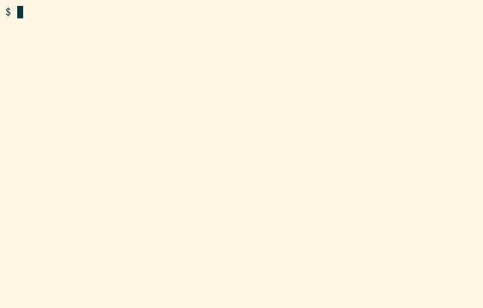

# rocfl


`rocfl` is a command line utility for interacting with
[OCFL](https://ocfl.io/) repositories on the local filesystem or in
S3. Its goal is to provide a logical view of OCFL objects and make
them easy to interact with in a unix-like way.



## Extension Support

`rocfl` supports the following extensions:

- [0001-digest-algorithms](https://ocfl.github.io/extensions/0001-digest-algorithms.html)
- [0002-flat-direct-storage-layout](https://ocfl.github.io/extensions/0002-flat-direct-storage-layout.html)
- [0003-hash-and-id-n-tuple-storage-layout](https://ocfl.github.io/extensions/0003-hash-and-id-n-tuple-storage-layout.html)
- [0004-hashed-n-tuple-storage-layout](https://ocfl.github.io/extensions/0004-hashed-n-tuple-storage-layout.html)
- [0005-mutable-head](https://ocfl.github.io/extensions/0005-mutable-head.html):
  Only read is supported; not write.
- [0006-flat-omit-prefix-storage-layout](https://ocfl.github.io/extensions/0006-flat-omit-prefix-storage-layout.html)

Additionally, it uses the following extensions for write support that
have not been specified:

- `rocfl-staging`: By default, new object versions are staged in this
  extension's directory the contents of which are OCFL repository like.
- `rocfl-locks`: This extension contains object file locks that provide
  limited concurrent modification protection.

## Install

The [releases page](https://github.com/pwinckles/rocfl/releases) has
pre-built binaries that should work on most common OSes and
architectures. You do _not_ need to install Rust to use them.

1. Download and unzip the appropriate binary
2. On Linux or Mac, execute `chmod +x rocfl` to [fix the permissions](https://github.com/actions/upload-artifact/issues/38)
3. Execute `./rocfl --help` to verify it works

### Local Build

Alternatively, you can build `rocfl` from source as follows:

1. Install [Rust](https://www.rust-lang.org/tools/install), and make
   sure `cargo` is on your `PATH`
2. Execute: `cargo install rocfl`
3. Verify the install: `rocfl --help`

If you want to build a binary that does not include the S3
integration, which adds a large number of dependencies, then you can
do so by running: `cargo install rocfl --no-default-features`.

## Configuration

`rocfl` supports optional configuration that makes it less verbose to
use. `rocfl` expects to find its configuration file in the following,
OS dependent location:

- **Linux**: `$HOME/.config/rocfl/config.toml`
- **Mac**: `$HOME/Library/Application
  Support/org.rocfl.rocfl/config.toml`
- **Windows**:
  `{FOLDERID_RoamingAppData}/rocfl/rocfl/config/config.toml`
  
You can easily edit the configuration by executing `rocfl config`,
which will create/open the config file for editing.

The config file may contain any number of sections structured as
follows:

``` toml
[repo-name]
# The name to attribute new OCFL versions to
author_name = "My Name"
# The URI address to associate with the above name
author_address = "mailto:name@example.com"
# The absolute path to the OCFL storage root
root = "/path/to/storage/root"
# The absolute path to the OCFL staging root
staging_root = "/path/to/staging/root"

# The next properties only apply when using S3
# The AWS region your bucket is in
region = "aws-region"
# The AWS credentials profile to load credentials from. If not specified, "default" is used.
profile = "aws-credentials-profile"
# The URL to the S3 endpoint. This is only needed if you are using a non-standard region
endpoint = "https://s3-endpoint"
# The S3 bucket the OCFL repository is in
bucket = "s3-bucket"
```

`repo-name` is the arbitrary name assigned to the configuration. This
is the value that you pass `rocfl` when invoking the `--name` option.

A special `[global]` section may be used to provide default values
across all configurations. This is primarily useful for defining
`author_name` and `author_address`.

All of these properties correspond to values that can be specified in
arguments to `rocfl`. `rocfl` resolves the configuration by first
loading the `global` config, then overlays the repository specific
config, and finally applies any values specified directly as command
line arguments.

Refer to the command line argument documentation for more information
on the configuration properties.

## Usage

The following is an overview of the features that `rocfl` supports.
For a detailed description of all of the options available, consult
the builtin help by executing `rocfl --help` or `rocfl <COMMAND> --help`.

### Read Commands

#### Validate

The `validate` command validates either an entire OCFL repository or
specific objects within the repository. Any issues that are identified
are reported with their corresponding [validation
code](https://ocfl.io/1.0/spec/validation-codes.html).

##### Examples

Validate an entire repository:

``` console
rocfl validate
```

Validate an entire repository without performing content fixity checks
and only reporting errors:

``` console
rocfl -q validate -n
```

Validate a specific object:

``` console
rocfl validate urn:example:rocfl:object-1
```

Validate multiple objects at specific paths relative the repository
root:

``` console
rocfl validate -p object-1/ object-2/
```

#### List

The `ls` command either lists all of the objects in a repository or
list the files in an OCFL object.

`rocfl` must scan the repository to locate objects. This can be slow
when operating on large repositories. The scan can be avoided when
listing an object's contents if the repository uses a supported
storage layout extension that is defined in the repository's
`ocfl_layout.json`

When listing files, only files in the most recent version are
returned. Previous versions can be queried with the `-v` option.

##### Examples

###### Listing Objects

The following command lists all of the object IDs in a repository
that's rooted in the current working directory:

```console
rocfl ls
```

This lists the same objects but with additional details, current
version and updated date:

```console
rocfl ls -l
```

Adding the `-p` flag additionally provides the path from the storage
root to the object:

```console
rocfl ls -lp
```

A subset of objects can be listed by providing a glob pattern to match
on:

```console
rocfl ls -lo '*object*'
```

###### Listing Object Contents

The contents of an object's current state are displayed by invoking
`ls` on a specific object ID:

```console
rocfl ls urn:example:rocfl:object-1
```

With the `-l` flag, additional details are displayed. In this case,
the version and date indicate when the individual file was last
updated:

```console
rocfl ls -l urn:example:rocfl:object-1
```

The `-p` flag can also be used here to display the paths to the
physical files on disk relative the storage root:

```console
rocfl ls -p urn:example:rocfl:object-1
```

The contents of previous versions are displayed by using the `-v`
option. The following command displays the files that were in the
first version of the object:

```console
rocfl ls -v1 urn:example:rocfl:object-1
```

An object's contents can be filtered by specifying a glob pattern to
match on:

```console
rocfl ls urn:example:rocfl:object-1 '*.txt'
```

The output is sorted by name by default, but can also be sorted
version or updated date:

```console
rocfl ls -l -s version urn:example:rocfl:object-1
```

Paths within in an object can be interpreted as containing logical
directories by using the `-D` flag. For example, the following will
list the logical files and logical directories that are direct
children of the logical directory `sub/dir`:

``` console
rocfl ls -D urn:example:rocfl:object-1 sub/dir
```

#### Log

The `log` command displays the version metadata for all versions of an
object. It can also be executed on a file within an object, in which
case only versions that affected the specified file are displayed.

##### Examples

Show all of the versions of an object in ascending order:

```console
rocfl log urn:example:rocfl:object-1
```

Only display the five most recent versions:

```console
rocfl log -rn5 urn:example:rocfl:object-1
```

Show all of the versions, but formatted so each version is on a single
line:

```console
rocfl log -c urn:example:rocfl:object-1
```

Show all of the versions that affected a specific file:

```console
rocfl log urn:example:rocfl:object-1 file1.txt
```

#### Show

The `show` command displays everything that changed in an object
within a specific version. If no version is specified, the most recent
changes are shown.

##### Examples

Show the changes in the most recent version:

```console
rocfl show urn:example:rocfl:object-1
```

Show the changes in the first version:

```console
rocfl show urn:example:rocfl:object-1 v1
```

Don't show the version metadata; only show the files that changed:

```console
rocfl show -m urn:example:rocfl:object-1
```

#### Diff

The `diff` command displays the files that changed between two
specific versions.

##### Example

Show the changes between the second and fourth versions:

```console
rocfl diff v2 v4
```

#### Cat

The `cat` command writes the contents of a file to `stdout`.

##### Examples

Display the contents of the head version of a file:

```console
rocfl cat urn:example:rocfl:object-1 file1.txt
```

Display the contents of a file from a specific version of the object:

```console
rocfl cat -v1 urn:example:rocfl:object-1 file1.txt
```

#### Status

The `status` command shows objects that have staged changes pending
commit, as well as what an object's pending changes are.

##### Examples

List all of the objects with staged changes:

``` console
rocfl status
```

List all of the file level changes to an object:

``` console
rocfl status urn:example:rocfl:object-1
```

Staged changes can also be examined using the more featureful `ls`,
`show`, and `cat` commands by adding the `-S` flag.

### Write Commands

`rocfl` supports updating OCFL objects by staging changes to objects
in a local staging repository. For filesystem based repositories, the
staging repository is located within the storage root's extensions
directory, and for S3 it's in the user's home application data.

The intended workflow is to accumulate a collection of updates to an
object, and then commit all of the changes to the object a single new
OCFL version.

#### Init

The `init` command creates new OCFL repositories.

##### Examples

Create a new repository using the default layout,
[0004-hashed-n-tuple-storage-layout](https://ocfl.github.io/extensions/0004-hashed-n-tuple-storage-layout.html):

``` console
rocfl -r /var/tmp/ocfl-repo-1 init
```

The default layout configuration can be changed by passing a config
file that contains the desired configuration:

``` console
rocfl -r /var/tmp/ocfl-repo-2 init -l 0003-hash-and-id-n-tuple-storage-layout -c
my-config.json
```

#### New

The `new` command stages new OCFL objects. New objects will not exist
in the main repository until they have been committed. When invoked
with no options, the object is created using all of the OCFL spec
recommend values.

##### Examples

Create a new object with non-standard settings:

``` console
rocfl new urn:example:rocfl:object-1 -d sha256 -c data -z 6
```

#### Copy

The `cp` command copies files from the local filesystem into a
staged object, or copies logical paths within an object to a new
location within the same object. This command attempts to mimic the
behavior of GNU `cp` as closely as possible.

##### Examples

Copy a directory into the object's root:

``` console
rocfl cp -r urn:example:rocfl:object-1 /path/to/src -- /
```

Copy several files into a logical directory within the object:

``` console
rocfl cp urn:example:rocfl:object-1 /path/to/files/* -- sub/dir
```

Copy several existing files internally to a new location:

``` console
rocfl cp -i urn:example:rocfl:object-1 'internal/*.txt' -- new-location
```

Copy an entire logical directory from an old version to a new location
in the staged version:

``` console
rocfl cp -ir -v2 urn:example:rocfl:object-1 src/dir -- dst/dir
```

#### Move

The `mv` command moves files from the local filesystem into a staged
object, or moves logical paths within an object to a new location
within the same object. This command attempts to mimic the behavior of
GNU `mv` as closely as possible.

##### Examples

Move a directory into the object's root:

``` console
rocfl mv urn:example:rocfl:object-1 /path/to/src -- /
```

Move several files into a logical directory within the object:

``` console
rocfl mv urn:example:rocfl:object-1 /path/to/files/* -- sub/dir
```

Move an existing file internally to a new location:

``` console
rocfl mv -i urn:example:rocfl:object-1 internal/file.txt -- new/location.txt
```

#### Remove

The `rm` command removes files from an object. If the removed files
were new to the staged version, then they are permanently removed and
will not appear anywhere in the object. Otherwise, references to the
files are removed from the staged version, but the files still exist
in prior versions.

##### Examples

Recursively remove a logical directory:

``` console
rocfl rm -r urn:example:rocfl:object-1 path/to/dir
```

Remove several individual files:

``` console
rocfl rm urn:example:rocfl:object-1 path/to/file1.txt path/to/file2.txt
```

Or with a glob:

``` console
rocfl rm urn:example:rocfl:object-1 'path/to/*.txt'
```

#### Reset

The `reset` command unstages changes made to an object. Additions are
removed and files that were deleted or modified are reverted to their
previous state.

##### Examples

Reset a file to its previous state:

``` console
rocfl reset urn:example:rocfl:object-1 file.txt
```

Reset an entire object to its previous state, removing all staged
changes:

``` console
rocfl reset urn:example:rocfl:object-1
```

#### Commit

The `commit` command moves an object's staged changes into the OCFL
object as a new version.

##### Examples

Commit changes to an object:

``` console
rocfl commit urn:example:rocfl:object-1 -n "My Name" -a "mailto:me@example.com" -m "commit
message"
```

This can be simplified if you define your name and address in [rocfl
configuration](#configuration). In which case, you can simply execute:

``` console
rocfl commit urn:example:rocfl:object-1 -m "commit message"
```

And your name and address will be automatically added to the version
metadata.

In order to commit an object to a repository without a defined storage
layout, the location to store the object with the repository must be
manually specified as follows:

``` console
rocfl commit urn:example:rocfl:object-1 -m "commit message" -r relative/path/to/object/root
```

#### Purge

The `purge` command permanently removes an object from the main OCFL
repository. This is **not** an operation that stages changes. However,
it will ask for confirmation before deleting an object.

## S3

### S3 Configuration

To connect to an OCFL repository in S3, you first need to create an
IAM user with access to the S3 bucket, and then setup a local
`~/.aws/credentials` file or environment variables as [described
here](https://docs.aws.amazon.com/cli/latest/userguide/cli-configure-files.html).
Credential profiles can be specified using the `--profile` option.
Then, when you invoke `rocfl` you must specify the bucket the
repository is in as well as the bucket region. For example:

```console
rocfl -R us-east-2 -b example-ocfl-repo ls
```

You can specify a sub directory, or prefix, that the repository is
rooted in within the bucket like this:

```console
rocfl -R us-east-2 -b example-ocfl-repo -r ocfl-root ls
```

Changes to objects are staged locally and are only pushed to S3 when
the staged version is committed. By default, changes are staged in the
following location:

- **Linux**: `$HOME/.local/share/rocfl/s3/staging/<sha256:BUCKET/ROOT>`
- **Mac**: `{FOLDERID_RoamingAppData}/org.rocfl.rocfl/data/s3/staging/<sha256:BUCKET/ROOT>`
- **Windows**: `$HOME/Library/Application Support/rocfl/rocfl/s3/staging/<sha256:BUCKET/ROOT>`

This location can be changed by setting the `--staging-root` option.

All of these properties can define defined in `rocfl`'s [config
file](#configuration), and activated by invoking `rocfl` using the
configuration `NAME` as follows:

``` console
rocfl -n NAME ls
```

### Important S3 Considerations

While `rocfl` supports all of the same operations on S3 as it does the
local filesystem, this does come with a couple of caveats:

1. Scanning for objects in S3 is very slow, and using a defined storage
   layout extension is key to improving performance.
2. `rocfl` does not provide any strong concurrency guarantees when
   modifying objects in S3. A file lock is used to guard changes in
   the staging repository, but there is an unchecked race condition if
   multiple processes attempt to commit changes to the same object
   from different staging locations.

## Roadmap

The following features are planned:

1. Export objects to a location outside the repository
2. Index objects when the storage layout is unknown
3. Unsafe mutating operations such as `squash`, `revert`, and
   `rewrite` that can be used to change an object's history
